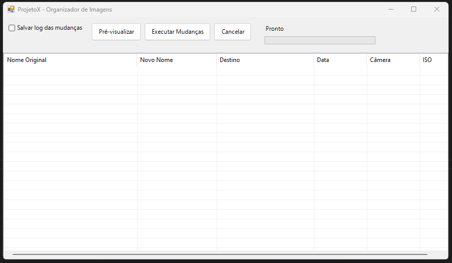
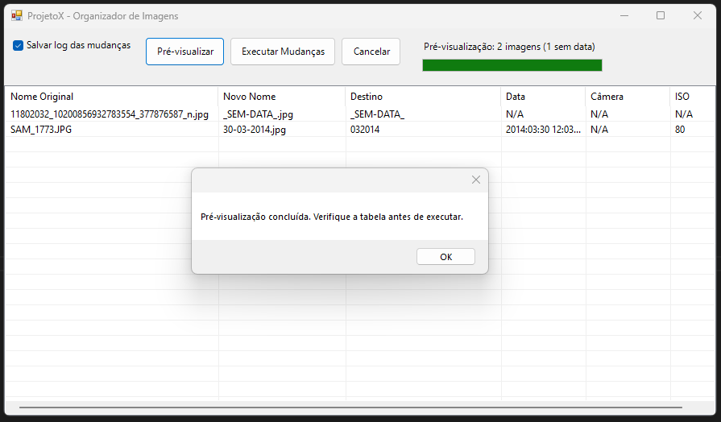

#  PicOrganizer - Organizador de Imagens

**PicOrganizer** é um **organizador gráfico de imagens** desenvolvido em PowerShell. Ele permite **renomear, organizar, mover entre diretórios e gerar logs de toda essa movimentação** com base nos metadados EXIF, de forma rápida e segura.

---

## ✨ Funcionalidades Principais

| Funcionalidade | Descrição |
|:--|:--|
| 📅 **Organização por data EXIF** | Extrai data de captura e organiza automaticamente |
| 📝 **Renomeação inteligente** | Nome no formato `dd-MM-yyyy` (ex: `10-06-2015.jpg`) |
| 📁 **Pastas automáticas** | Agrupa em `MMYYYY` (ex: `062015`) |
| 🔍 **Pré-visualização** | Tabela completa antes de executar qualquer alteração |
| 📊 **Barra de progresso** | Feedback visual em tempo real durante processamento |
| 📈 **Estatísticas** | Contador de imagens total e sem data EXIF |
| 🛡️ **Sem data = tratado** | Imagens sem EXIF vão para pasta `_SEM-DATA_` |
| 📝 **Log opcional** | Arquivo de auditoria com todas as operações |
| ⚡ **Performance** | Otimizado para milhares de imagens via `List[object]` |

---

## 📌 Pré-visualização do Programa




> O ListView exibe os arquivos originais, o novo nome, destino e dados EXIF extraídos.

---

## 🖥️ Requisitos

- Windows PowerShell 5.x ou PowerShell 7+  
- Sistema operacional: Windows (usa `System.Windows.Forms` e `System.Drawing`)  
- Permissão para executar scripts:

---
## 🗂 Estrutura do Projeto
|PicOrganizer|/|
|--------|-|
|programa.ps1  |      # Script principal do organizador de imagens EXIF |
|LICENSE       |      # Arquivo da Licença MIT  |
|README.md     |      # Documentação e instruções do projeto    |
|CHANGELOG.md  |      # Histórico de versões e alterações   |

---
## Descrição dos arquivos:

|Arquivo      | Função                                                                  |
|-------------|-------------------------------------------------------------------------|
|programa.ps1 | Script principal que organiza, renomeia e gera logs das imagens.        |
|LICENSE      | Licença MIT para o projeto.                                             |
|README.md    | Documentação completa com instruções de uso, funcionalidades e setup.   |
|CHANGELOG.md | Histórico de alterações e melhorias do projeto.                         |
|docs/        | (Opcional) Documentação adicional.                                      |

---
## 🚀 Instalação e Uso
1. Clonar o repositório

Abra o terminal no VSCode ou PowerShell e execute:

```bash
git clone https://github.com/Grupo-Valebrum/ProjetoX.git
cd programa
```
2. Configurar permissões para execução de scripts

No PowerShell, rode:

```bash
powershell Set-ExecutionPolicy RemoteSigned -Scope CurrentUser
```

Isso permite que o script seja executado localmente sem restrições.

3. Executar o PicOrganizer

No terminal, execute o script principal:

```bash
powershell -ExecutionPolicy Bypass -File .\programa.ps1
```

4. Como usar:
    1. Selecionar a pasta de origem com as imagens que deseja organizar.
    2. Selecionar a pasta de destino onde as imagens renomeadas e organizadas serão salvas.
    3. Pré-visualizar as alterações no ListView do programa.
    4. Escolher entre Executar Mudanças ou Cancelar.
    5. Se desejar, marcar a opção para salvar log detalhado das operações.
    6. Imagens sem dados EXIF serão renomeadas para _SEM-DATA_ e incluídas em pastas correspondentes.

---
## 🗂️ Estrutura de Saída
1. Entrada:
```C:\Fotos_Desorganizadas\
├── IMG_0001.jpg          ← EXIF: 2023:12:25 14:30:00
├── IMG_0002.jpg          ← EXIF: 2024:01:15 09:15:00
├── 2023-12-25.jpg        ← EXIF: 2023:12:25 10:00:00
├── sem_exif.jpg          ← SEM EXIF
└── vazia.png             ← SEM EXIF
```
2. Saída:
```C:\Fotos_Organizadas\
├── 122023\               ← dezembro de 2023
│   ├── 25-12-2023.jpg
│   └── 25-12-2023_1.jpg  ← sufixo automático para duplicatas
├── 012024\               ← janeiro de 2024
│   └── 15-01-2024.jpg
└── _SEM-DATA_\           ← imagens sem data EXIF
    ├── _SEM-DATA_.jpg
    └── _SEM-DATA_1.png
```
---
## ⚡ Performance
A v0.3.2 inclui otimizações para diretórios com milhares de imagens:
| Técnica | Implementação | Impacto |
|---------|---------------|---------|
| Sem Lock de Arquivo | FileStream + Image.FromStream | Leitura EXIF paralela e segura |
| Memória otimizada | List[Object] em vez de array += | Escalabilidade Linear |
| UI Responsiva | Atualização progressiva da barra | Feedback constante ao usuário |
| Baixa Latência | Sleep de 5ms | Processamento mais rápido |

---
## 📜 Changelog
Veja todas as mudanças em CHANGELOG.md.

Resumo da v0.3.2:

✅ Barra de progresso visual

✅ Nome de arquivo dd-MM-yyyy

✅ Estatísticas de pré-visualização

✅ Performance otimizada para grandes volumes

---
## 🤝 Contribuição
Contribuições são bem-vindas! Para reportar bugs ou sugerir features:

Abra uma Issue

Descreva o problema ou sugestão com exemplos
Pull requests são bem-vindos para melhorias documentadas

---
## 📞 Suporte

🐛 Bug report: Abrir Issue

💡 Sugestão: Discussions

📧 Contato: Via issues do GitHub
